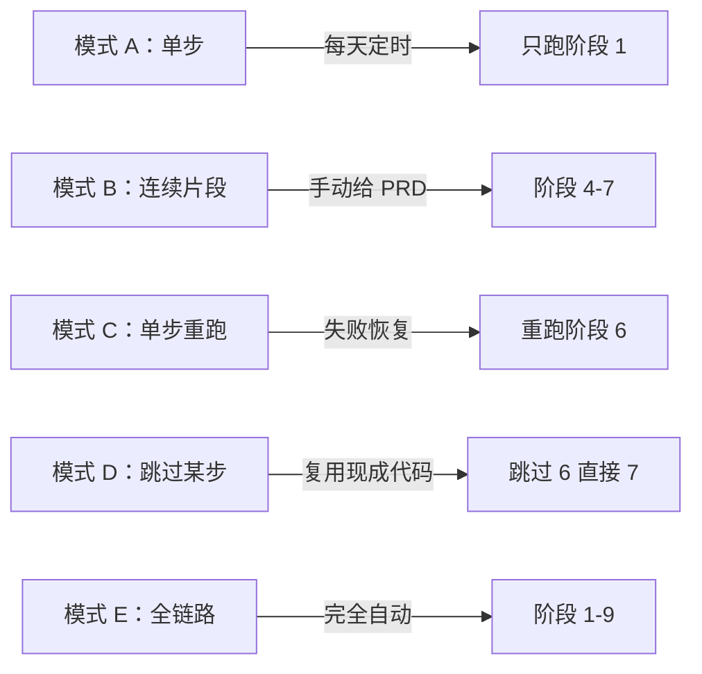
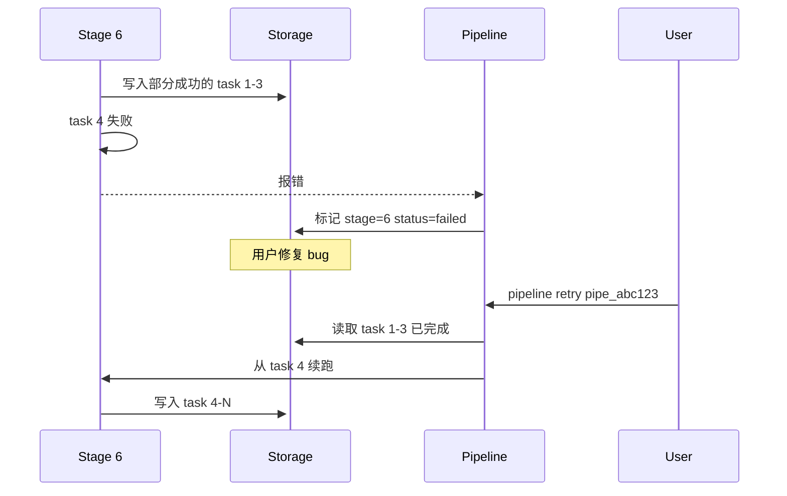

# 执行模式与工具兼容

> Pipeline 必须支持两件事：
> 1. **任何阶段都能单独跑** —— 不用全链路才能用
> 2. **不锁定单一 AI 工具** —— 阶段可以跑在 Claude Code / Cursor / Codex CLI / API 等任何环境
>
> **当前 v0.4**：无统一 `pipeline run` CLI；按 [README](../README.md) 逐步调用 `helpers/*.py` + Agent skill。下文 CLI 为**目标设计**。

---

## Part A：模块化执行

### 5 种执行模式



| 模式 | 命令示例 | 典型用途 |
|------|---------|---------|
| **A 单步** | `pipeline run --stage 1` | MVP 第一片，每天定时跑雷达 |
| **B 片段** | `pipeline run --from 5 --to 7 --input prd.json` | 已知做什么，跳过发现阶段 |
| **C 单步重跑** | `pipeline run --stage 6 --resume pipe_abc123` | 失败恢复 |
| **D 跳过某步** | `pipeline run --stage 7 --skip 6 --input pr.json` | 复用现成资产 |
| **E 全链路** | `pipeline run --from 1 --to 9` | 全自动模式（最后阶段） |

---

### CLI 接口设计（v1 草稿）

```bash
# 基本结构
pipeline run [OPTIONS]

# 选项
--stage <N>              # 单步模式：只跑阶段 N
--from <N>               # 起始阶段
--to <N>                 # 结束阶段
--skip <N>[,<M>...]      # 跳过指定阶段
--input <file|id>        # 输入：文件路径 或 上次 pipeline ID
--resume <pipeline_id>   # 从已有 pipeline 续跑
--config <file>          # 配置文件
--tool <name>            # 指定执行工具（见 Part B）
--dry-run                # 模拟跑，不真正调用 AI
--cost-limit <usd>       # 成本上限保护

# 辅助命令
pipeline list                        # 列出所有 pipeline
pipeline show <pipeline_id>          # 查看某个 pipeline 状态
pipeline output <pipeline_id> <stage>  # 查看某阶段产出
pipeline retry <pipeline_id>         # 重试失败阶段
pipeline cancel <pipeline_id>        # 取消运行中的 pipeline
```

---

### 阶段如何独立运行（核心设计）

每个阶段是一个**纯函数**，依赖 3 件事：

```python
class Stage:
    name: str
    inputs: dict     # 来自上一阶段或手动构造
    outputs: dict    # 写入存储
    
    def run(input: InputContract) -> OutputContract:
        ...
    
    def validate_input(input) -> bool: ...
    def validate_output(output) -> bool: ...
```

**输入来源**（任选其一）：
1. 上一阶段的输出（`pipeline_id` 关联）
2. 手动构造的 JSON 文件（`--input file.json`）
3. 从存储读取的 fixture（开发期）

---

### 中间态存储（解耦上下游）

```yaml
storage:
  pipeline_runs:           # pipeline 元数据
    - id: pipe_abc123
      created_at: ...
      current_stage: 4
      status: awaiting_decision_2
      
  stage_outputs:           # 每阶段独立存储
    - pipeline_id: pipe_abc123
      stage: 1
      output: { pain_points: [...] }
      generated_at: ...
      cost_usd: 2.5
    - pipeline_id: pipe_abc123
      stage: 2
      output: { scored: [...] }
```

**好处**：
- 任何时候都可以**快照查看**某阶段产出
- 重跑某阶段时**保留之前数据**，可对比
- 方便**测试**（直接给上一阶段的产出当输入）

---

### 失败恢复



**关键**：阶段内部要**幂等 + 可断点续跑**，不是从头重来。

---

### 测试模式（开发关键）

```bash
# 1. 用 fixture 跑某一阶段，不调用真实 AI
pipeline run --stage 2 --input fixtures/pain_points.json --tool mock

# 2. dry-run：跑但不调用真 LLM，只验证输入/输出格式
pipeline run --stage 4 --input prd_input.json --dry-run

# 3. 给上一阶段的输出作为 fixture
pipeline output pipe_abc123 1 > fixtures/stage1_output.json
pipeline run --stage 2 --input fixtures/stage1_output.json
```

---

## Part B：多工具兼容

### 设计原则

```
Pipeline 不绑定任何特定 AI 工具。
工具是「执行引擎」，可替换。
```

---

### 两层执行模型

```
┌──────────────────────────────────────────────────────────┐
│  自动化层（Automation）                                   │
│  - 跑在 cron / GitHub Actions / 远端服务器                │
│  - 用 API 或 headless CLI 调用，不需要 IDE                │
│  - 适用：阶段 1, 2, 3, 6, 8, 9                          │
└──────────────────────────────────────────────────────────┘

┌──────────────────────────────────────────────────────────┐
│  交互层（Interactive）                                    │
│  - 跑在 IDE / 桌面 / 终端                                 │
│  - 人类参与的工作                                          │
│  - 适用：决策点 ①②③④ + 阶段 4, 5（半自动）                │
└──────────────────────────────────────────────────────────┘
```

---

### 工具兼容矩阵

| 阶段 | 类型 | 推荐工具 | 备选工具 |
|------|------|---------|---------|
| 1 痛点雷达 | 自动 | **Claude API**（headless） | OpenAI API、本地 Ollama |
| 2 机会评估 | 自动 | **Claude API** | OpenAI API |
| 3 用户研究 | 自动 | **Claude API** | OpenAI API |
| 4 PRD | 半自动 | **Claude Code**（IDE） | Cursor、Codex CLI |
| 5 架构设计 | 半自动 | **Claude Code** | Cursor、Codex CLI |
| 6 编码 | 自动 | **Claude Code (headless)** | Cursor (CLI)、Codex CLI、Aider |
| 7 测试审查 | 自动 | **Claude API** | OpenAI API |
| 8 部署 | 自动 | **GitHub Actions + Claude API** | 任何 CI/CD |
| 9 运营 | 自动 | **Claude API** | OpenAI API |
| 🚦 决策点 | 交互 | **Web Dashboard** + 通知 | Slack Bot、CLI |

---

### Skill 文件的多工具兼容

依赖的 Skill 集合都已经支持多工具：

| Skill 库 | Claude Code | Cursor | Codex CLI | Gemini CLI | 备注 |
|---------|:-----------:|:------:|:---------:|:----------:|------|
| `karpathy-skills` | ✅ CLAUDE.md | ✅ CURSOR.md | ✅ AGENTS.md | ✅ | 多文件版本 |
| `superpowers` | ✅ Plugin | ✅ Plugin | ✅ Plugin | ✅ Extension | 官方支持 |
| `agency-agents` | ✅ Markdown | ✅ Rules | ✅ AGENTS.md | ⚠️ 需转换 | 文本文件可移植 |
| `scientific-agent-skills` | ✅ | ✅ | ✅ | ⚠️ | 同上 |

**结论**：Skill 文件本身**与工具无关**（都是 Markdown 提示词），只要工具能加载它就能用。

---

### 工具选择策略（按场景）

#### 场景 1：自动化跑（CI / Cron）
```yaml
preferred:
  - claude-api          # 直接调 API，无 IDE 开销
  - claude-code-headless  # 需要工具调用时
fallback:
  - openai-api
  - aider               # 开源、纯 CLI
```

#### 场景 2：人参与的开发（决策点 + 半自动阶段）
```yaml
preferred:
  - claude-code         # 你已经熟悉
  - cursor              # 如果你更喜欢
  - openhuman           # 如果想要桌面 Agent 体验
fallback:
  - 任何你顺手的 IDE
```

#### 场景 3：成本敏感
```yaml
preferred:
  - claude-haiku-4-5   # API 调用，便宜
  - gemini-flash        # 备选，更便宜
  - 本地 ollama         # 完全免费但慢
```

---

### 配置示例

```yaml
# pipeline.config.yaml
default_tool: claude-api
default_model: claude-sonnet-4-6

stages:
  1:
    tool: claude-api
    model: claude-haiku-4-5    # 大批量分类，便宜
    
  4:
    tool: claude-code           # 人参与的 PRD 编写
    model: claude-opus-4-7      # 关键产出，用最好的
    
  6:
    tool: claude-code-headless
    model: claude-opus-4-7
    fallback_tool: aider         # Claude Code 失败时用 aider
    
  9:
    tool: claude-api
    model: claude-haiku-4-5
```

---

### 跨工具状态共享

不同阶段用不同工具，但**共享同一份状态**：

```
PostgreSQL  ←─→ Pipeline Orchestrator ←─→ 任何执行工具
                       ↓
              [agentmemory] 跨工具记忆
```

**关键**：执行工具是临时的，**状态/记忆/产出**都存在 Pipeline 中央存储。

---

### 工具切换的实际意义

#### A. 你白天用 Claude Code 写 PRD（阶段 4）
```bash
# 在 Claude Code 里
/skill writing-prd
# 写完后输出到 ./outputs/{pipeline_id}/prd.md
```

#### B. 晚上 cron job 用 Claude API 跑代码（阶段 6）
```bash
# GitHub Actions
pipeline run --stage 6 --tool claude-api-headless --input ./outputs/.../approved_spec.json
```

#### C. 周末你换 Cursor 试试 review（阶段 7）
```bash
# 在 Cursor 里
@codegraph 加载阶段 6 输出的代码
@superpowers/requesting-code-review 跑审查
```

→ **同一条 pipeline，三个工具，无缝切换**。

---

## 实施优先级

### MVP 阶段（前 4 周）
- 只支持 1 个工具（**Claude API + Claude Code**）
- 实现基本的 CLI（模式 A：单步执行）
- 不实现多工具兼容（先把功能跑通）

### v0.5（4-8 周）
- 增加模式 B（连续片段）+ 模式 C（重跑）
- 增加 Cursor 兼容（用相同的 Skill 文件）

### v1.0（8-12 周）
- 全部 5 种执行模式
- 多工具配置化（`pipeline.config.yaml`）
- 工具自动 fallback

---

## 设计取舍

### 为什么不一开始就支持所有工具？

| 选项 | 优点 | 代价 |
|------|------|------|
| 一开始支持所有工具 | 灵活 | 抽象层多、bug 多、开发慢 |
| 先支持 Claude Code | 快速验证想法 | 后期切换有成本 |

**推荐**：先 Claude Code 跑通，再加多工具。**永远先做"对一个人有用"，再做"对很多人有用"**。

---

## 总结

| 问题 | 答案 |
|------|------|
| 能不能单独跑某一阶段？ | ✅ 设计就是为这个 |
| 能不能跑某几个连续阶段？ | ✅ 5 种模式都支持 |
| 能不能不用 Claude Code？ | ✅ 工具可替换 |
| 不同阶段能用不同工具吗？ | ✅ 共享中央状态 |
| MVP 要一次实现这些吗？ | ❌ 先 Claude Code 跑通，再扩展 |
