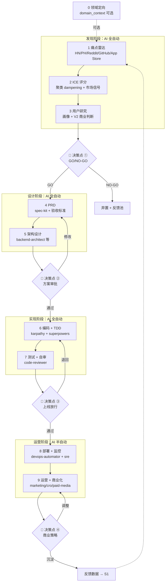
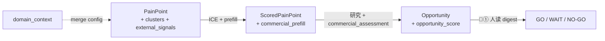
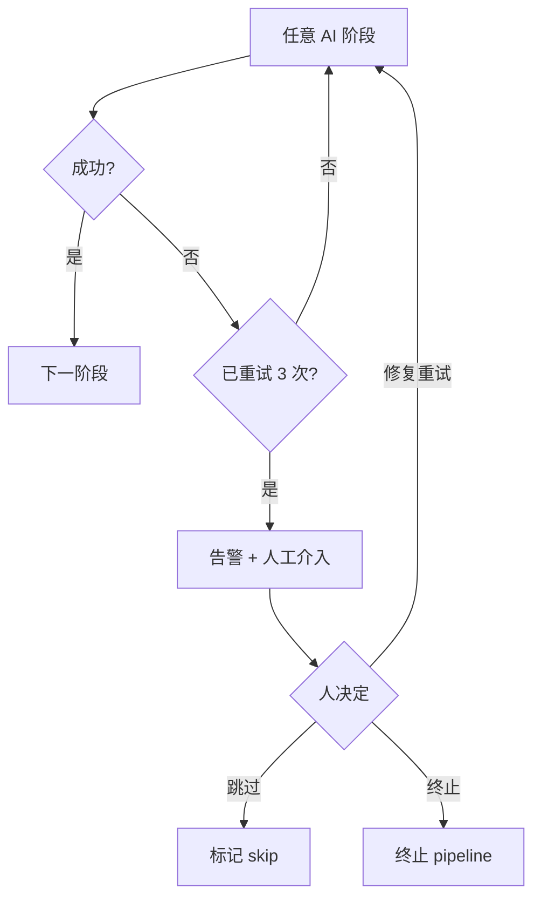

# 完整流程图

> **v0.4 已实现**：Stage 0（可选）+ Stage 1–3 + V2 商业判断层。Stage 4–9 与下方「运营/设计」子图为目标架构。

## 端到端流程（含决策点）



## 数据流转视角

**已实现（v0.4）**



**目标占位（Stage 4–9，未实现）**

```mermaid
flowchart LR
    OPP[Opportunity] -->|🚦①| SO[SelectedOpportunity]
    SO -->|PRD| PRD[PRD]
    PRD -->|设计| TS[TechSpec]
    TS -->|🚦②| AS[ApprovedSpec]
    AS -->|实现| PR[PullRequest]
    PR -->|🚦③| DEP[Deployment]
    DEP -->|运营| LP[LiveProduct]
    LP -->|🚦④| GM[GrowthMetrics]
    GM -.->|回流| PP[PainPoint]
```



## 失败/退回路径（重要）



## Helper 自动步骤（v0.4）

| 阶段 | Helper | 自动产出 |
|------|--------|----------|
| 0 | `build_domain_context.py` + `merge_radar_config.py` | `domain_context.json`, `radar.config.yaml` |
| 1 | `build_pain_batch.py` | `pain_clusters.json`, `external_signals.json` |
| 2 | `build_scored_batch.py` | `market_signals` enrich, `commercial_prefill.json` |
| 3 | `build_opportunity.py` | `opportunity_score`, `external_signals_summary` |

## 并行 vs 串行

| 阶段 | 串/并 | 说明 |
|------|------|------|
| 0 领域定向 | 串行 | 对话生成 domain_context（可选） |
| 1 痛点雷达 | 并行 | 多数据源同时抓取 |
| 2 机会评估 | 并行 | 每个痛点独立评分 |
| 3 用户研究 | 串行 | 在选中痛点后顺序进行 |
| 4–9 | — | **目标占位**，见下方 Design/Build/Operate 子图 |

## 时间维度

```
单条 Pipeline 从痛点到上线，目标周期：
   - 简单工具类：2-4 周
   - 中型 SaaS：6-12 周
   - 复杂产品：> 12 周（建议拆分多个 MVP）

每天/每周节奏：
   - 阶段 1（痛点雷达）：每天定时跑，沉淀候选池
   - 阶段 2-3：每周批量处理新候选
   - 决策点 ①：每周一次（你的 review 时间）
   - 阶段 4-7：项目化，按 sprint 跑
   - 决策点 ②③：按需触发
   - 阶段 8-9：持续运行
   - 决策点 ④：每月一次复盘
```
