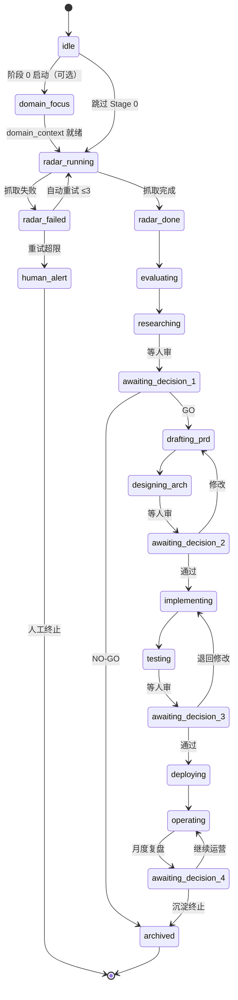
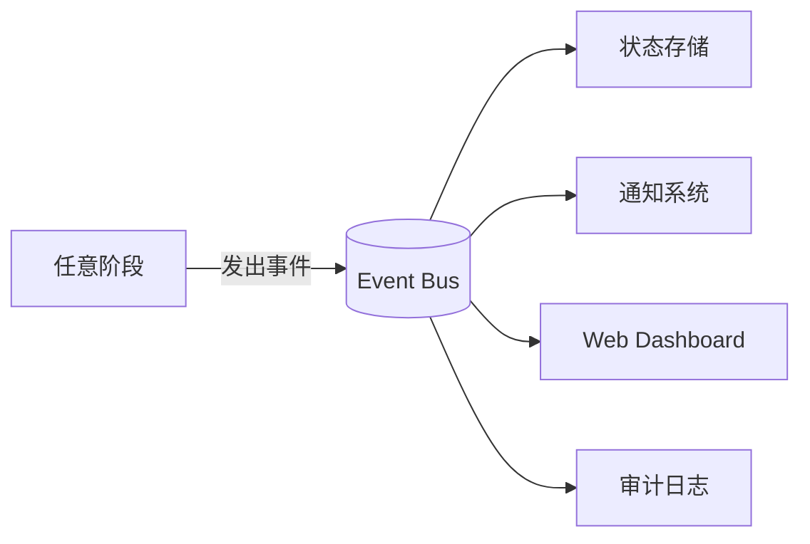

# Pipeline 状态机

> **说明**：本文描述**目标**编排架构（Postgres / Event Bus / 决策超时）。**当前 v0.4 实现**为 `runs/{pipeline_id}/` 下的 JSON 产物 + 人工读 digest 决策，无中央状态存储。见 [README](../README.md) 快速开始。

## 顶层状态图



## 状态分类

| 状态类型 | 状态名 | 说明 |
|----------|--------|------|
| **运行态** | `domain_focus` `radar_running` `evaluating` `researching` `drafting_prd` `designing_arch` `implementing` `testing` `deploying` `operating` | AI 正在执行 |
| **等待态** | `awaiting_decision_1/2/3/4` | 等人决策 |
| **失败态** | `*_failed` | 阶段失败，等重试或人工 |
| **告警态** | `human_alert` | 重试超限，必须人工介入 |
| **终态** | `archived` | 流水线终结（成功或主动放弃） |

## 状态对应的可执行操作

| 状态 | AI 可做 | 人可做 |
|------|---------|--------|
| `idle` | 启动新 pipeline | 配置数据源 |
| `radar_running` | 自动抓取 | 查看进度 |
| `awaiting_decision_1` | （只能等） | GO / NO-GO |
| `awaiting_decision_2` | （只能等） | 通过 / 修改 |
| `awaiting_decision_3` | （只能等） | 通过 / 退回 |
| `awaiting_decision_4` | （只能等） | 调整策略 / 沉淀 |
| `human_alert` | （只能等） | 调试 / 重试 / 终止 |
| `archived` | （终态） | 复盘 / 反馈数据 |

## 重试策略

```yaml
retry_policy:
  default:
    max_attempts: 3
    backoff: exponential
    initial_delay_seconds: 30
  by_stage:
    radar:
      max_attempts: 5         # 数据源不稳定，多重试
    implementing:
      max_attempts: 2         # 编码失败重试代价高
    deploying:
      max_attempts: 1         # 部署失败必须人工介入
```

## 关键不变量（Invariants）

任何时候必须满足：

1. **状态唯一性**：一条 pipeline 同时只能有一个 active 状态
2. **决策点必经**：从 `*_running` 到 `awaiting_decision_*` 之前不能跳过决策
3. **数据契约**：每次状态转移都必须产出符合 schema 的输出
4. **审计完整**：每次状态转移记录 who / when / why
5. **回滚可逆**：从决策点退回时必须保留之前的产出（不删数据）

## 状态持久化

**当前实现**：`runs/{pipeline_id}/` 下的 JSON + `_judgments/` + `_raw/`（本地文件，gitignore）。

**目标占位**：

```yaml
storage:
  primary: postgres        # pipeline 状态主存储
  cache: redis             # 临时态、热数据
  artifacts: s3 / local_fs # PRD/代码/部署产物
  memory: agentmemory      # 跨会话的 AI 上下文记忆
```

## 事件总线（重要）



事件示例：
```yaml
- type: stage.completed
  pipeline_id: uuid
  stage: radar
  output_summary: "100 个痛点候选"
  timestamp: ...

- type: human.decision_requested
  pipeline_id: uuid
  decision_point: 1
  options: [GO, NO_GO]
  timeout_at: 2026-05-25T00:00:00Z

- type: stage.failed
  pipeline_id: uuid
  stage: implementing
  error: "..."
  retry_count: 2
```

## 决策超时机制

```yaml
decision_timeouts:
  decision_1: 7d   # 7 天没决策自动 NO-GO
  decision_2: 3d   # 3 天没决策自动退回 PRD
  decision_3: 1d   # 1 天没决策自动 staging（不上 prod）
  decision_4: 30d  # 30 天没决策自动继续当前策略
```

## 人工介入触发

```yaml
human_alert_triggers:
  - condition: retry_count >= max_attempts
    severity: high
  - condition: cost_usd > $50
    severity: medium
  - condition: stage_duration > 24h
    severity: medium
  - condition: critical_issue_in_review
    severity: high
notification_channels:
  - email
  - slack
  - dashboard
```
